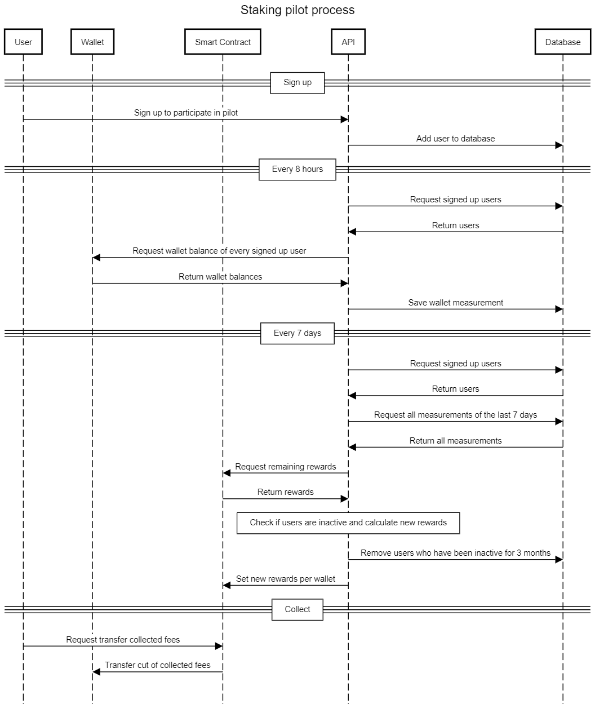

[](https://github.com/thxprotocol/api/actions/workflows/ci.yml)

# THX Claim API

This repository holds the code for the THX Claim API project. A REST API that can be used to interact the the THX Smart Contract layer and which main purpose is to make it easier for developers to utilize blockchain technology in their applications.

This API is meant to distribute the collected fees of different tokens among token holders. Every 8 hours balances of signed up users are fetched and saved into a database, 3 measurements of a day are used to calculate the median wallet balances and used to calculate the user's cut of the collected fees.

## Diagram


## Index

1. Prerequisites
2. Installing
3. Usage
4. Testing
5. Interface
6. Database Schema Migration

## 1. Prerequisites

-   Docker
-   [NVM](https://github.com/nvm-sh/nvm)

We use docker to run our dependencies like mongo and ganache in. We run the development server locally, managing a common node version using Node Version Manager.
You can also manually install the correct node version but usage of NVM is recommended.

## 2. Installing

```
# 1. Install/activate current nodejs defined in .nvmrc
nvm use

# 2. Provide environment variables
cp .env.example .env

# 3. Checkout SCSS submodule
git submodule init
git submodule update

# 4. Install packages
npm install --ci

# 5. Start working (docker compose up -d && npm run watch:debug)
npm run dev

# 6. shut down dependencies
docker compose down
```

## 3. Usage

The thx_mainnet and thx_testnet containers will start with pre-filled wallets and all required contracts will be deployed automatically.

## 4. Testing

```
# Run e2e tests
npm run test
```

## 5. Interface

Swagger Documentation is provided in the controllers of the routes and lives at the following endpoints:

-   [API Health](https://localhost:3000/v1/health/)
-   [Local API Specs](https://localhost:3000/v1/docs/)
-   [Staging API Specs](https://dev.api.thx.network/v1/docs/)
-   [Production API Specs](https://api.thx.network/v1/docs/)
-   [Developer Documentation](http://docs.thx.network)

## 6. Database Schema Migration

### 6.1 To add a new migration script, use the following CLI command

```
npm run migrate:create name-of-my-script
```

A new file will be created inside migrations folder with a corresponding timestamp.

```
|_ migrations/
   |- 20210108114324-name-of-my-script.js
```

### 6.2 To add a new property to the existing collection

Considering we want to add a quantity property to the products collection, the migration could be as follows:

```
export = {
    async up(db: Db) {
        return db.collection('products').updateMany({}, { $set: { quantity: 10 } });
    },

    async down(db: Db) {
        return db.collection('products').updateMany({}, { $unset: { quantity: null } });
    },
};
```

### 6.3 Running migrations

To get the migration status

```
npm run migrate:status
```

To run your migrations, simply run the command

```
npm run migrate:db
```

To rollback a migration use the down command

```
npm run migrate:undo-last
```
